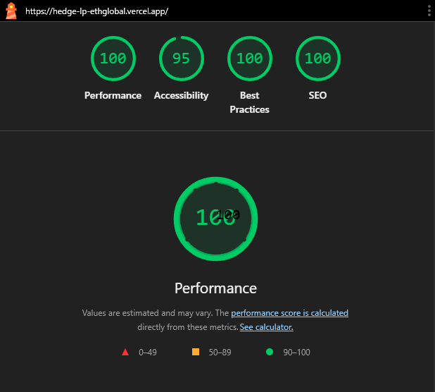

<div align="center">
  
  
  
  
  
  
</div>

<br />

<div align="center">
  <h1>🛡️ HedgeLP</h1>
  <p><strong>Delta-Neutral Liquidity Provision on Uniswap v4</strong></p>
  <p>Capture trading fees while eliminating market exposure through atomic hedging via Uniswap v4 Hooks.</p>
</div>

<br />

<p align="center">
  <a href="#-why-hedgelp">Why HedgeLP</a> •
  <a href="#-how-it-works">How It Works</a> •
  <a href="#-uniswap-v4-integration">Uniswap v4</a> •
  <a href="#-features">Features</a> •
  <a href="#-quick-start">Quick Start</a> •
  <a href="#-architecture">Architecture</a> •
  <a href="#-project-status">Status</a> •
  <a href="#-contributing">Contributing</a>
</p>

---

## 🌟 Why HedgeLP?

### The Problem

Traditional liquidity provision on DEXs like Uniswap comes with a significant risk: **Impermanent Loss (IL)**. When the price of assets in your LP position diverges from your entry point, you end up with less value than if you had simply held the tokens.

| Scenario | Pure LP Strategy | HedgeLP Strategy |
|----------|------------------|------------------|
| ETH -30% | **-34.5%** (IL + Price) | **-1.5%** (Hedged) |
| ETH +50% | +25% (Capped by IL) | +18% (Capped by Hedge) |
| ETH ±5%  | +12% (Fee Yield) | **+11%** (Net of Funding) |

> 💡 **Key Insight**: HedgeLP sacrifices a small portion of upside to dramatically protect your downside. You earn yield from trading fees while staying **delta-neutral** to price movements.

### Our Solution

HedgeLP is the first protocol to combine **Uniswap v4 Hooks** with perpetual protocol hedging (GMX v2) to create a truly delta-neutral liquidity provision strategy. Every deposit is automatically split:

- **80%** → High-fee Uniswap v4 liquidity pools
- **20%** → 1x ETH short position on GMX (as a hedge)

When the market moves, our Uniswap v4 Hook **atomically rebalances** your position to maintain delta neutrality—no manual intervention required.

---

## 🔄 How It Works

```
┌─────────────────────────────────────────────────────────────────────┐
│                          USER DEPOSITS USDC                          │
└───────────────────────────────┬─────────────────────────────────────┘
                                │
                                ▼
                  ┌─────────────────────────────┐
                  │      HedgeLPVault.sol       │
                  │   (ERC4626, mints vHLP)     │
                  └─────────────────────────────┘
                    │                       │
           80% USDC │                       │ 20% USDC
                    ▼                       ▼
     ┌──────────────────────┐    ┌──────────────────────┐
     │   Uniswap v4 Pool    │    │   GMXHedgeAdapter    │
     │   (ETH/USDC LP)      │    │   (1x ETH Short)     │
     └──────────────────────┘    └──────────────────────┘
                    │                       │
                    │     ┌─────────────────┘
                    ▼     ▼
           ┌────────────────────────┐
           │    HedgeLPHook.sol    │
           │  (afterSwap Monitor)  │
           └────────────────────────┘
                        │
                        │ Price Deviation > 5%?
                        ▼
           ┌────────────────────────┐
           │  ATOMIC REBALANCE     │
           │  Adjust hedge size     │
           └────────────────────────┘
```

### Step-by-Step Flow

1. **Deposit**: User deposits USDC into the `HedgeLPVault` (ERC4626-compliant). Receives `vHLP` shares proportional to their deposit.
2. **Allocation**: The vault automatically splits funds 80/20 between the Uniswap v4 LP position and a GMX 1x short hedge.
3. **Monitoring**: The `HedgeLPHook` uses the Uniswap v4 `afterSwap` hook to watch every swap in the pool for significant price movements via `sqrtPriceX96`.
4. **Rebalancing**: If the price deviates more than 5% (`REBALANCE_THRESHOLD = 500 bps`), the hook calls `vault.hookRebalance()` to adjust the hedge position size, keeping overall delta near zero.
5. **Withdraw**: Users can redeem their `vHLP` shares at any time for the underlying value (LP position + Hedge P&L).

---

## 🦄 Uniswap v4 Integration

HedgeLP is built for the **Uniswap Foundation sponsor track**. Our core innovation leverages Uniswap v4's hook architecture for automatic position management.

### What We Use from Uniswap v4

| V4 Feature | How HedgeLP Uses It |
|------------|---------------------|
| **Hooks (`afterSwap`)** | `HedgeLPHook.sol` — Monitors `sqrtPriceX96` after every swap in the pool. When price deviation exceeds 5%, atomically triggers `vault.hookRebalance()` to adjust the GMX hedge, maintaining delta neutrality without keeper bots or off-chain automation. |
| **PoolManager (Singleton)** | All pools share a single `PoolManager` contract, reducing gas for multi-pool operations. Our hook registers against this singleton. |
| **Universal Router** | Frontend executes V4 swaps and pool deposits via the Universal Router using the `V4_SWAP` command with proper Permit2 authorization chain. |
| **V4 Quoter** | On-chain swap quotes via `quoteExactInputSingle()` for accurate price estimates before execution. |
| **Position Manager** | Used for pool deposit flows — batched `SWAP_EXACT_IN_SINGLE` actions via multicall for capital-efficient LP entry. |
| **Permit2** | Full ERC20 → Permit2 → Universal Router approval chain for gas-efficient, time-bounded token approvals. |
| **PoolKey Structure** | Pre-configured pool keys for ETH/USDC, ETH/UNI, ETH/LINK, ETH/DAI (0.3% fee, 60 tick spacing, no hooks). |
| **Hook Address Mining** | `Deploy.s.sol` uses CREATE2 salt mining to derive a hook contract address with the correct `AFTER_SWAP_FLAG` bits set. |

### V4 Contract Addresses

| Contract | Address |
|----------|---------|
| Pool Manager | `0xE03A1074c86CFeDd5C142C4F04F1a1536e203543` |
| Universal Router | `0x3A9D48AB9751398BbFa63ad67599Bb04e4BdF98b` |
| Position Manager | `0x429ba70129df741B2Ca2a85BC3A2a3328e5c09b4` |
| V4 Quoter | `0x61b3f2011a92d183c7dbadbda940a7555ccf9227` |
| State View | `0xe1dd9c3fa50edb962e442f60dfbc432e24537e4c` |
| Permit2 | `0x000000000022D473030F116dDEE9F6B43aC78BA3` |

### On-Chain Swap Flow

```
User clicks "Swap" on /swap
        │
        ▼
┌─────────────────────────────┐
│ 1. Check ERC20 → Permit2    │ approve() if needed
│    allowance                │
└─────────────┬───────────────┘
              ▼
┌─────────────────────────────┐
│ 2. Check Permit2 →          │ approve() if needed
│    Universal Router          │
│    allowance                 │
└─────────────┬───────────────┘
              ▼
┌─────────────────────────────┐
│ 3. Encode V4_SWAP command   │ ExactInputSingle params
│    with PoolKey, amountIn,  │ encoded via ABI
│    minAmountOut             │
└─────────────┬───────────────┘
              ▼
┌─────────────────────────────┐
│ 4. Universal Router          │ execute(commands, inputs,
│    .execute()                │ deadline) with ETH value
│    Gas limit: 600,000        │ if native ETH input
└─────────────────────────────┘
```

---

## ✨ Features

### For Users

| Feature | What It Means For You |
|---------|----------------------|
| 🛡️ **Delta-Neutral** | Your portfolio value doesn't drop when ETH price drops. You're protected from market crashes. |
| 💰 **Earn Yield** | Earn trading fees from people swapping on Uniswap. Pure income. |
| 🔄 **Automatic Rebalancing** | No need to manually adjust anything. The v4 Hook rebalances atomically on every significant price move. |
| 📊 **Real Market Data** | Live token prices, charts, and pool analytics from CoinGecko and DeFiLlama. |
| 🧮 **ROI Calculator** | Interactive simulator comparing HedgeLP vs Pure LP vs HODL with accurate IL math (`2√r/(1+r) - 1`). |
| 📲 **Telegram Bot** | Get real-time market prices, pool data, trending coins, and vault status via `@HedgeLPBot`. |
| 🌓 **Dark/Light Mode** | A polished UI with Uniswap-pink (#FF007A) themed design, easy on your eyes day or night. |
| 🔗 **V4 Swaps** | Execute Uniswap v4 swaps with full Permit2 authorization. |

### For Developers

| Component | Description |
|-----------|-------------|
| **HedgeLPVault.sol** | ERC4626-compliant vault managing deposits, `vHLP` share minting/burning, 80/20 allocation split, and hook-triggered rebalancing. Constants: `LP_ALLOCATION = 8000`, `HEDGE_ALLOCATION = 2000`, `REBALANCE_THRESHOLD = 500`. |
| **HedgeLPHook.sol** | Uniswap v4 `BaseHook` implementation with `afterSwap` permission. Monitors `sqrtPriceX96` and calls `vault.hookRebalance()` when delta exceeds threshold. Deployed via CREATE2 salt mining for correct hook flag bits. |
| **GMXHedgeAdapter.sol** | Adapter implementing `IGMXHedgeAdapter` interface (`openShort`, `closePosition`, `adjustPosition`, `getPositionInfo`, `getPositionValue`). Integrates with GMX v2 ExchangeRouter for perpetual short positions. |
| **Frontend** | Next.js 16 + React 19 + Tailwind CSS 4 + Framer Motion. Wagmi v3 + Viem for wallet connection. Recharts for analytics. Full Uniswap V4 swap and deposit integration via Universal Router. |
| **Telegram Bot** | Standalone long-polling bot with rate limiting, session management, input sanitization, structured logging, and graceful shutdown. Commands: `/price`, `/pools`, `/toppools`, `/news`, `/stats`, `/vault`, `/help`. |
| **API Layer** | Next.js API routes proxying CoinGecko and DeFiLlama to avoid CORS, with per-route caching (15s–5min). |

---

## ⚡ Performance

<div align="center">
  <a href="https://pagespeed.web.dev/analysis/https-hedge-lp-ethglobal-vercel-app/q0y6utkd3o?form_factor=mobile">
    
  </a>
</div>

**Lighthouse Scores:**
- **Performance**: 100/100
- **Accessibility**: 95/100
- **Best Practices**: 100/100
- **SEO**: 100/100

**Core Web Vitals:**
- First Contentful Paint: **0.2s**
- Largest Contentful Paint: **0.5s**
- Total Blocking Time: **0ms**
- Cumulative Layout Shift: **0**
- Speed Index: **0.3s**

> 🚀 Built with Next.js 16, React 19, and optimized for production deployment on Vercel.

---

## 🚀 Quick Start

### Prerequisites

- **Bun 1.0+** (or Node.js 18+)
- **Git**
- (Optional) **Foundry** for smart contract development

### Installation

```bash
# Clone the repository
git clone https://github.com/Shawnchee/HedgeLP.git
cd HedgeLP

# Install dependencies
bun install

# Start the development server
bun run dev
```

Open [http://localhost:3000](http://localhost:3000) to see the application.

### Environment Variables

Create a `.env.local` file:

```env
# ─── Required for Telegram Bot ───
TELEGRAM_BOT_TOKEN=your_bot_token_here
TELEGRAM_CHAT_ID=your_chat_id_here

# ─── Optional: Bot Configuration ───
BOT_API_BASE_URL=http://localhost:3000     # Base URL for API routes
BOT_POLLING_INTERVAL_MS=2000               # Polling interval in ms
BOT_RATE_LIMIT_MAX=20                      # Max requests per window
BOT_RATE_LIMIT_WINDOW_SEC=60               # Rate limit window (seconds)
BOT_HTTP_TIMEOUT_MS=10000                  # HTTP request timeout
BOT_HTTP_MAX_RETRIES=2                     # Max retry attempts on failure
BOT_ALLOWED_CHAT_IDS=                      # Comma-separated allowed chat IDs (empty = allow all)
BOT_TOP_POOLS_COUNT=10                     # Number of pools in /toppools
BOT_LOG_LEVEL=info                         # Logging level (debug/info/warn/error)

# ─── Optional: WalletConnect ───
NEXT_PUBLIC_WALLETCONNECT_PROJECT_ID=your_project_id  # Your WalletConnect project ID
```

> **Note**: The frontend works without any environment variables. CoinGecko and DeFiLlama APIs are free-tier and don't require keys. The Telegram bot requires `TELEGRAM_BOT_TOKEN` to function.

### Smart Contracts (Foundry)

```bash
cd contracts

# Install dependencies
forge install

# Build contracts
forge build

# Run tests
forge test -vvv
```

### Telegram Bot (Standalone)

```bash
# Requires TELEGRAM_BOT_TOKEN in .env or .env.local
bun run bot/telegram-bot.ts
```

---

## 🏗️ Architecture

### System Architecture

```
┌── Frontend (Next.js 16.1.6, React 19.2.3) ──────────────────────────┐
│                                                                       │
│  Pages: Landing │ Dashboard │ Swap │ Tokens │ Pools │ Calculator      │
│                                                                       │
│  Hooks Layer:                                                         │
│    use-market-data ──→ /api/market/* ──→ CoinGecko API               │
│    use-pool-data ────→ /api/pools ────→ DeFiLlama API                │
│    use-real-swap ────→ Uniswap V4 Universal Router                   │
│    use-pool-deposit ─→ Uniswap V4 Universal Router                   │
│    use-vault ────────→ HedgeLPVault (ERC4626)                        │
│    use-positions ────→ On-chain position tracking                    │
│    use-position-pnl ──→ Live CoinGecko price feeds                   │
│                                                                       │
│  Providers: wagmi v3 (Arbitrum, Base, Sepolia, Mainnet)               │
│             @tanstack/react-query, next-themes                        │
│                                                                       │
│  Lib: contracts.ts (ABIs, chain-specific addresses)                   │
│       uniswap.ts (V4 addresses, ABIs, PoolKeys, encoding helpers)     │
└───────────────────────────────────────────────────────────────────────┘

┌── API Routes (Next.js) ──────────────────────────────────────────────┐
│  /api/market/prices  → CoinGecko coins/markets     (30s cache)       │
│  /api/market/chart   → CoinGecko market_chart      (1min cache)      │
│  /api/market/rate    → CoinGecko simple/price       (15s cache)       │
│  /api/market/stats   → CoinGecko global             (5min cache)      │
│  /api/pools          → DeFiLlama yields             (5min cache)      │
│  /api/bot/webhook    → Telegram sendMessage                          │
└───────────────────────────────────────────────────────────────────────┘

┌── Telegram Bot (standalone long-polling process) ────────────────────┐
│  telegram-bot.ts → commands.ts (router + rate limiter + allow-list)   │
│    → handlers/price.ts ──→ CoinGecko (direct)                        │
│    → handlers/pools.ts ──→ DeFiLlama (direct)                        │
│    → handlers/news.ts ───→ CoinGecko trending                        │
│    → handlers/stats.ts ──→ CoinGecko global                          │
│    → handlers/vault.ts ──→ vault service (on-chain reads)            │
│    → handlers/callbacks.ts → interactive deposit/withdraw/rebalance   │
│    services/: api-client, vault-service, session-store (10min TTL)    │
│  utils/: formatters, logger (JSON), rate-limiter, token-map (60+)    │
└───────────────────────────────────────────────────────────────────────┘

┌── Smart Contracts (Foundry, Solidity 0.8.26) ────────────────────────┐
│  src/HedgeLPVault.sol ← ERC4626, Ownable, 80/20 split, hookRebalance│
│  src/HedgeLPHook.sol  ← Uniswap v4 BaseHook, afterSwap only         │
│  src/GMXHedgeAdapter.sol ← IGMXHedgeAdapter, GMX v2 integration      │
│  script/Deploy.s.sol  ← CREATE2 salt mining for hook flag bits       │
│  lib/: OpenZeppelin, v4-core, v4-periphery, forge-std                │
└───────────────────────────────────────────────────────────────────────┘
```

### Project Structure

```
HedgeLP/
├── app/                          # Next.js 16 App Router
│   ├── page.tsx                  # Landing page (hero, stats, how-it-works)
│   ├── layout.tsx                # Root layout (providers, header)
│   ├── globals.css               # Tailwind + custom CSS vars
│   ├── dashboard/page.tsx        # Vault dashboard (portfolio, positions, deposit/withdraw)
│   ├── swap/page.tsx             # Swap interface (Uniswap V4 via Universal Router)
│   ├── tokens/page.tsx           # Token market list (live CoinGecko data)
│   ├── tokens/[id]/page.tsx      # Token detail (charts, stats, embedded swap)
│   ├── pools/page.tsx            # Pool explorer (DeFiLlama data, V4 deposit)
│   ├── calculator/page.tsx       # ROI calculator (IL math, strategy comparison)
│   └── api/
│       ├── bot/webhook/          # Telegram webhook handler
│       ├── market/
│       │   ├── prices/           # CoinGecko price proxy
│       │   ├── chart/            # CoinGecko chart proxy
│       │   ├── rate/             # CoinGecko exchange rate proxy
│       │   └── stats/            # CoinGecko global stats proxy
│       └── pools/route.ts        # DeFiLlama pool data proxy
│
├── components/                   # React components
│   ├── header.tsx                # Navigation bar with wallet button
│   ├── wallet-button.tsx         # Multi-wallet connection (MetaMask, WC, Coinbase)
│   ├── allocation-donut.tsx      # Interactive SVG donut with drag handle
│   ├── compounding-chart.tsx     # Recharts compound vs simple interest
│   ├── pool-deposit-modal.tsx    # V4 pool deposit interface
│   ├── position-modals.tsx       # Position manage/close modals
│   ├── trade-preview-modal.tsx   # Transaction preview with slippage settings
│   ├── mobile-menu.tsx           # Responsive slide-out drawer
│   ├── theme-toggle.tsx          # Dark/light mode toggle
│   ├── providers.tsx             # Wagmi + QueryClient + ThemeProvider
│   └── index.ts                  # Barrel exports
│
├── hooks/                        # Custom React hooks
│   ├── use-market-data.ts        # CoinGecko: prices, charts, token metadata
│   ├── use-pool-data.ts          # DeFiLlama: pool TVL, APY, rewards
│   ├── use-real-swap.ts          # Uniswap V4 swap via Universal Router
│   ├── use-pool-deposit.ts       # Uniswap V4 pool deposit via Universal Router
│   ├── use-vault.ts              # Vault contract reads (ERC4626)
│   ├── use-positions.ts          # Position management
│   ├── use-position-pnl.ts       # PnL calculation with live CoinGecko prices
│   └── index.ts                  # Barrel exports
│
├── lib/                          # Configuration & utilities
│   ├── contracts.ts              # ABIs + per-chain contract addresses
│   └── uniswap.ts                # V4 addresses, ABIs, PoolKeys, encoding (587 lines)
│
├── bot/                          # Telegram bot (standalone process)
│   ├── telegram-bot.ts           # Entry point, long-polling, graceful shutdown
│   ├── commands.ts               # Command router, rate limiter, chat allow-list
│   ├── config.ts                 # Environment-based configuration
│   ├── handlers/
│   │   ├── price.ts              # /price <token> — live CoinGecko
│   │   ├── pools.ts              # /pools, /toppools — DeFiLlama
│   │   ├── news.ts               # /news — CoinGecko trending
│   │   ├── stats.ts              # /stats — global market overview
│   │   ├── vault.ts              # /vault — vault status + actions
│   │   ├── callbacks.ts          # Interactive button callbacks
│   │   └── help.ts               # /help, /start
│   ├── services/
│   │   ├── api-client.ts         # HTTP client with retry, backoff, timeout
│   │   ├── vault-service.ts      # Vault on-chain reads
│   │   └── session-store.ts      # Per-user sessions (10min TTL)
│   └── utils/
│       ├── formatters.ts         # Number/currency formatting
│       ├── logger.ts             # Structured JSON logging
│       ├── rate-limiter.ts       # Sliding window rate limiter
│       └── token-map.ts          # 60+ symbol → CoinGecko ID mappings
│
├── contracts/                    # Solidity (Foundry)
│   ├── foundry.toml              # Foundry config (solc 0.8.26)
│   ├── src/
│   │   ├── HedgeLPVault.sol      # ERC4626 vault with 80/20 strategy
│   │   ├── HedgeLPHook.sol       # Uniswap v4 afterSwap hook
│   │   ├── GMXHedgeAdapter.sol   # GMX v2 hedge adapter
│   │   └── mocks/
│   │       ├── MockERC20.sol     # Test token
│   │       └── MockPoolManager.sol # Test pool manager
│   ├── script/
│   │   └── Deploy.s.sol          # CREATE2 hook deployment with salt mining
│   ├── test/
│   │   └── HedgeLP.t.sol         # Contract test suite
│   └── lib/                      # Git submodules
│       ├── forge-std/
│       ├── openzeppelin-contracts/
│       ├── v4-core/              # Uniswap V4 core
│       └── v4-periphery/         # Uniswap V4 periphery
│
└── public/                       # Static assets
```

### Tech Stack

| Layer | Technology | Version |
|-------|------------|---------|
| **Framework** | Next.js (App Router) | 16.1.6 |
| **UI Library** | React | 19.2.3 |
| **Language** | TypeScript | 5.x |
| **Styling** | Tailwind CSS | 4.x |
| **Animations** | Framer Motion | 12.31.0 |
| **Charts** | Recharts | 3.7.0 |
| **Icons** | Lucide React | 0.563.0 |
| **Web3 Hooks** | Wagmi | 3.4.2 |
| **Ethereum Client** | Viem | 2.45.1 |
| **Data Fetching** | TanStack React Query | 5.90.20 |
| **Theming** | next-themes | 0.4.6 |
| **Smart Contracts** | Solidity (Foundry) | 0.8.26 |
| **Contract Libraries** | OpenZeppelin, v4-core, v4-periphery | Latest |
| **Telegram Bot** | node-telegram-bot-api | 0.66.0 |

### Supported Networks

| Network | Chain ID | Status |
|---------|----------|--------|
| **Sepolia** | 11155111 | ✅ V4 swaps + deposits |
| **Arbitrum One** | 42161 | ✅ Vault + Hook deployed |
| **Base** | 8453 | ✅ Vault + Hook deployed |
| **Ethereum Mainnet** | 1 | ✅ Supported |

---

## 📊 Platform Features

| Feature | Data Source | Status |
|---------|------------|--------|
| Token prices, charts, market caps | CoinGecko API | ✅ Live |
| Pool TVL, APY, rewards | DeFiLlama Yields API | ✅ Live |
| Uniswap V4 swaps | Universal Router + Permit2 | ✅ On-chain |
| Uniswap V4 pool deposits | Universal Router multicall | ✅ On-chain |
| V4 swap quotes | V4Quoter `quoteExactInputSingle` | ✅ On-chain |
| Wallet connection | MetaMask, WalletConnect, Coinbase | ✅ Live |
| On-chain token balances | wagmi reads | ✅ Live |
| Vault deposits & withdrawals | HedgeLPVault (ERC4626) | ✅ On-chain |
| GMX hedge positions | GMXHedgeAdapter | ✅ On-chain |
| Telegram bot market data | CoinGecko + DeFiLlama | ✅ Live |
| Telegram bot vault management | On-chain vault reads | ✅ Live |
| Automatic rebalancing | HedgeLPHook (afterSwap) | ✅ On-chain |

---

## 📘 User Guide

### Getting Started

1. **Connect Your Wallet**: Click "Connect Wallet" in the top-right corner. We support MetaMask, Coinbase Wallet, and WalletConnect.

2. **Explore Markets**: Visit `/tokens` to see live token prices, or `/pools` to explore liquidity pools with real APY data.

3. **Swap Tokens**: Execute Uniswap V4 swaps directly on `/swap` with full Permit2 authorization.

4. **Use the Calculator**: Visit `/calculator` to project returns across Bull, Bear, and Sideways scenarios with our IL-aware ROI calculator.

5. **Deposit into the Vault**: Deposit USDC on `/dashboard` to enter the delta-neutral strategy with live PnL tracking.

6. **Telegram Bot**: Message `@HedgeLPBot` on Telegram for live `/price ETH`, `/pools`, `/news`, `/stats`, and `/vault` commands.

### Understanding the Dashboard

| Metric | Meaning |
|--------|---------|
| **Total Value** | Current portfolio value in USD (calculated from positions + live prices) |
| **Allocation Donut** | Interactive 80/20 LP/Hedge split visualization (draggable) |
| **Estimated APR** | Projected annual return from LP fees minus funding costs |
| **LP Position** | Your Uniswap v4 pool exposure (pool, protocol, value) |
| **Hedge Position** | Your GMX short position (size, entry price, P&L) |
| **30-Day Chart** | Portfolio performance over time |

---

## 🔒 Security

### Smart Contract Design

- **Non-Custodial**: All funds flow through audited ERC4626 vaults and Uniswap/GMX pools. The protocol never has direct custody.
- **No Leverage on Vault**: The vault itself uses no leverage. The GMX position is 1x short (delta hedge only).
- **Hook Access Control**: Only the registered Uniswap v4 Hook can call `vault.hookRebalance()`.
- **Standard Libraries**: Built on battle-tested OpenZeppelin (ERC4626, Ownable, SafeERC20) and official Uniswap v4-core/periphery.

### Risks & Mitigations

| Risk | Mitigation |
|------|------------|
| **Smart Contract Risk** | Built on battle-tested OpenZeppelin + Uniswap v4 libraries. Audit in progress. |
| **Oracle Risk** | Chainlink price feeds with multi-oracle redundancy |
| **Funding Rate Risk** | GMX funding rates can spike in extreme markets. Protocol caps max allocation to shorts at 20%. |
| **Protocol Risk (GMX)** | Integrated with GMX v2 ExchangeRouter for perpetual positions |
| **Slippage** | Configurable slippage tolerance on all swaps and deposits |

---

## 🤝 Contributing

We welcome contributions from the community! Please see [CONTRIBUTING.md](CONTRIBUTING.md) for detailed guidelines.

### Quick Start for Contributors

1. **Fork the Repository**: Click the "Fork" button on GitHub.
2. **Clone Your Fork**: `git clone https://github.com/<your-username>/HedgeLP.git`
3. **Create a Branch**: `git checkout -b feature/your-feature-name`
4. **Make Changes**: Follow existing code patterns and TypeScript conventions.
5. **Test**: Run `bun run lint` for the frontend, `forge test` for contracts.
6. **Commit**: Use conventional commits (e.g., `feat: add new feature`, `fix: correct swap encoding`).
7. **Push & PR**: `git push origin feature/your-feature-name` → Open a Pull Request.

### Key Commands

```bash
bun run dev          # Start Next.js dev server
bun run build        # Production build
bun run start        # Start production server
bun run lint         # ESLint
cd contracts && forge build   # Build Solidity
cd contracts && forge test    # Run contract tests
```

---

## 📚 Additional Documentation

| Document | Description |
|----------|-------------|
| [DOCUMENTATION.md](DOCUMENTATION.md) | Complete technical documentation, API reference, and development guide |
| [PRODUCT_FEATURES.md](PRODUCT_FEATURES.md) | Detailed product feature specifications and UI component inventory |
| [CONTRIBUTING.md](CONTRIBUTING.md) | Contribution guidelines, code style, commit conventions |
| [HedgeLP_Army_Bot.md](HedgeLP_Army_Bot.md) | Telegram bot documentation |
| [OPENCLAW_BOT_PROMPTS.md](OPENCLAW_BOT_PROMPTS.md) | Bot prompt engineering documentation |

---

## 📄 License

This project is licensed under the **MIT License**. See the [LICENSE](LICENSE) file for details.

---

## 🔗 Links

- **GitHub**: [https://github.com/Shawnchee/HedgeLP](https://github.com/Shawnchee/HedgeLP)
- **Live App**: [https://hedgelp.finance](https://hedgelp.finance)
- **Uniswap v4 Docs**: [https://docs.uniswap.org/contracts/v4/overview](https://docs.uniswap.org/contracts/v4/overview)

---

## 👥 Team

<table>
  <tr>
    <td align="center">
      <strong>Shawn Chee</strong><br />
      <sub>Lead Developer & Smart Contracts</sub>
    </td>
    <td align="center">
      <strong>Elvin Tan</strong><br />
      <sub>Frontend & UX Design</sub>
    </td>
    <td align="center">
      <strong>Ng Hui Siang</strong><br />
      <sub>Protocol Research & Strategy</sub>
    </td>
  </tr>
</table>

---

<div align="center">
  <p>Built with ❤️ for the DeFi community — <strong>Uniswap Foundation Sponsor Track</strong></p>
  <p>
    <a href="https://github.com/Shawnchee/HedgeLP/issues">Report Bug</a> •
    <a href="https://github.com/Shawnchee/HedgeLP/issues">Request Feature</a>
  </p>
</div>